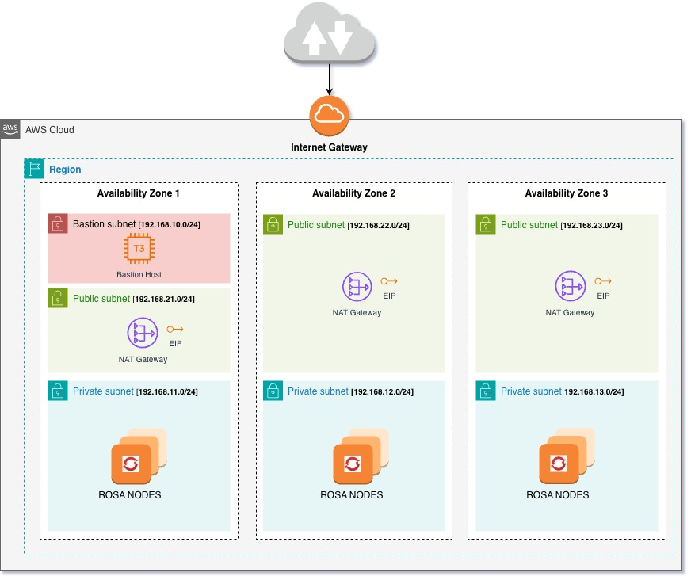

# ROSA w/ private link and STS

The code in this repo will create the AWS resources required to deploy Red Hat OpenShift Service on AWS (ROSA) cluster using private link and AWS Secure Token Service for enhanced security.
It will create the cluster in a single AZ or in 3 AZs depending on the root module to use.

## Resources

### Cluster

 * VPC
 * Public and Private subnets
 * Internet GW
 * EIP
 * NAT GW
 * Routing tables, rules and association for each subnet

### Bastion

 * Extra subnet
 * Routing table, rules and association for bastion subnet
 * Security group
 * Public key
 * Bastion instance

## Architecture Diagram for Multi-AZ Deployment




## Prerequisites

 * The terraform AWS provider will need the user to be [authenticated](https://registry.terraform.io/providers/hashicorp/aws/latest/docs#authentication-and-configuration)
 * The terraform CLI

## Deployment

1. Clone this repo
```
$ git clone https://github.com/mauroseb/terraform-rosa.git
```
2. Create a terraform.tfvars setting values for the input variables. At least __cluster_name__ and __pubkey__.
```
$ cd terraform-rosa/roots/rosa_privatelink_sts_3azs
$ cat > terraform.tfvars <<__EOF__
aws_region = "eu-central-1"   
cluster_name = "my-test"
pubkey = "ssh-rsa AAAAB3Nza..."
__EOF__
```

3. Deploy AWS resources
```
$ terraform init
$ terraform plan -out "rosa.plan"
$ terraform apply "rosa.plan"
```


## Deploy Cluster

- Run the script that is displayed in the output of terraform apply command.
- SSH into the bastion host as instructed in the same output

## Destroy Environment
1. Delete the ROSA cluster
```
$ rosa delete cluster --cluster=my-test --watch
```
2. Destroy the environment
```
$ terraform apply -destroy
```

